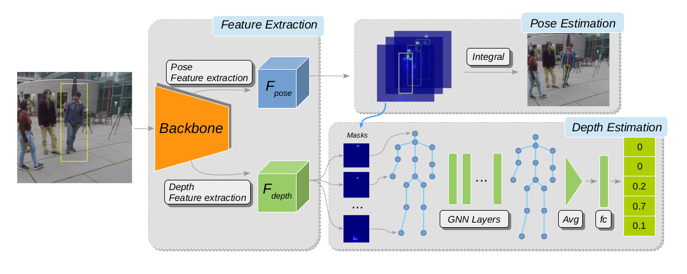

# HDNet: Human Depth Estimation For Multi-Person Camera-Space Localization



This repository includes the source code for our ECCV 2020 paper on monocular image human depth estimation for camera-space multi-person 3D pose localization. Please read our paper for more details at [https://arxiv.org/abs/2007.08943](https://arxiv.org/abs/2007.08943).

Bibtex:

```
@inproceedings{lin2020hdnet,
    title={HDNet: Human Depth Estimation for Multi-Person Camera-Space Localization},
    author={Lin, Jiahao and Lee, Gim Hee},
    booktitle={ECCV},
    year={2020}
}
```

### Environment

The code is developed and tested on the following environment

* Python 3.5.2
* PyTorch 1.1.0
* CUDA 9.0

### Dataset

The source code is for training and testing on [Human3.6M](http://vision.imar.ro/human3.6m) dataset.

##### Training data

To generate images for training, we provide a script ```generate_training_images.py``` to transform raw videos to full resolution images with proper naming. Please download raw videos from [Human3.6M](http://vision.imar.ro/human3.6m) website. After running the provided script, put the generated ```train``` folder under ```data/Human36M/images/``` directory.

##### Testing data

Testing images can be downloaded [here](https://drive.google.com/file/d/13b_0eL15GcAqeeTxkvwnvdIAxSbmbPqC/view?usp=sharing). Put the ```test``` folder under ```data/Human36M/images/``` directory.

##### Annotations

Processed annotations can be downloaded [here](https://drive.google.com/file/d/1tfbDKp0dGZSotaQ72jApT7WXzZIpEqf7/view?usp=sharing). Put all files under ```data/Human36M/annotations/``` directory.

The dataset should be organized as shown below:

```
    data/Human36M
            └── images
                └── train
                    ├── s_01_act_02_subact_01_ca_01/
                    ├── ...
                    └── s_08_act_16_subact_02_ca_04/
                └── test
                    ├── s_09_act_02_subact_01_ca_01/
                    ├── ...
                    └── s_11_act_16_subact_02_ca_04/
            └── annotations
                ├── subject_1.h5
                ├── subject_1_cpn.h5
                ├── ...
                ├── subject_11.h5
                └── subject_11_cpn.h5
```

### Training

To train a model, run:

```
python train.py [OPTIONS value]
```

Refer to the source code in ```train.py``` for available OPTIONS.

Logs and models will be saved under ```exp/[EXP_TAG]```.

### Evaluation

To evaluate a model named ```EXP_TAG```, run:

```
python test.py --tag EXP_TAG
```

Our pre-trained model is available for download [here](https://drive.google.com/file/d/1N6moNuQdRh4NeAsX7R3OutFPbFpeEs2I/view?usp=sharing). Place the model under ```exp/pretrained/saved_models/``` and run:

```
python test.py --tag pretrained
```
